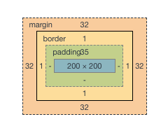
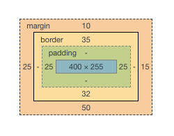
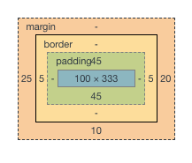
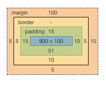
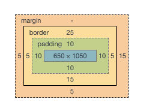

# Exercise: Box Model

## Scope
In this exercise, you will have a chance to test your understanding of the box model, and your ability to use CSS to manipulate an element's box model regions.

Below are 5 different images of element's box model regions. Your task is to look at each box model image and write the CSS properties that would set up an element's box model as described in the image.

### Question 1

### Question 2

### Question 3

### Question 4

### Question 5

