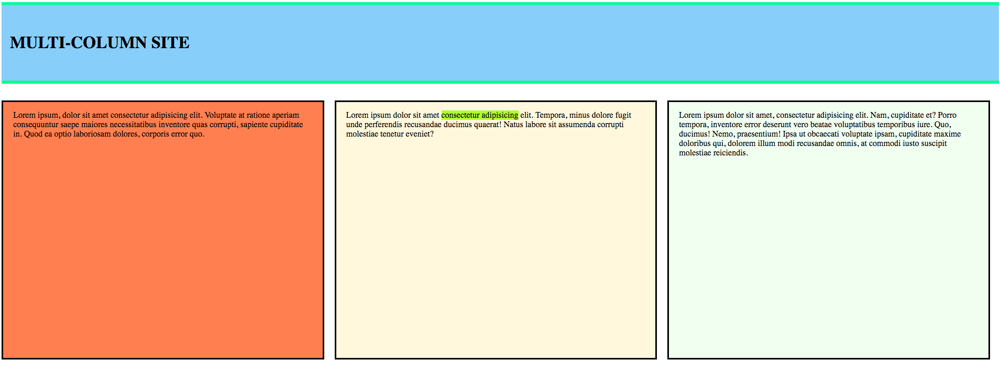

# Exercise: Multi-Column Site

## Scope
In this exercise your task is to re-create a simple multi-column design based on the instructions below and a visual reference. This will challenge you to use your newfound skills with CSS box model and the display property.

Take a look at the image below, to get an idea of what you will be creating.

## Instructions
Some specific guidelines are given below:

* There should be a header that spans across the whole width of the screen.
    * It should have a padding of 2rem on the top and bottom, and 1rem on the left and right.
    * It should have a `lightskyblue` background
    * It should have an `h1` displaying a title
    * It should have a border on the top and bottom that is solid, `springgreen` and 6px thick. There should be no border on the left and right of the header.
    * It should have 2 rem margin of space below it.
* Below the header, create a 3 column layout with the following specifications:
    * There should be 1 rem of horizontal space between each column
    * Each column should have a solid black border that is 3px thick
    * The backgrounds of the columns should be `coral`, `lightyellow` & `honeydew`
    * Inside each column there should be 1rem of padding at the top and bottom, and 1.2 rem of padding on the sides.
    * Use a `span` element within the text of the center column to highlight some text inline without breaking up the text. Use the color `greenyellow` for the highlight.
        * **Hint**: use the background color property with the `span`