# Exercise: Chrome DevTools

## Instructions
1. Open the included `fresh-eats` index.html file in a web-browser.
2. To open Chrome DevTools, click on the Chrome kebab menu, select More Tools then Developer Tools. Alternatively, you can use a shortcut, on **macOS** - `Option + Command + I`, on **Windows** - `F12` or `Control + Shift + I`.
3. To open dev-tools with a DOM element pre-selected, right-click the element on the page and select Inspect

Due to the **tool** nature of Chrome DevTools, the following exercise will focus on highlighting major functionality with some suggested exercises. It is also a good idea to spend some time and experiment with the tool on your own to get a feel for the useful features it provides.

Chrome DevTools has the following main sections illustrated in the screenshot below. The following description items correspond to the section numbers presented in the screenshot.

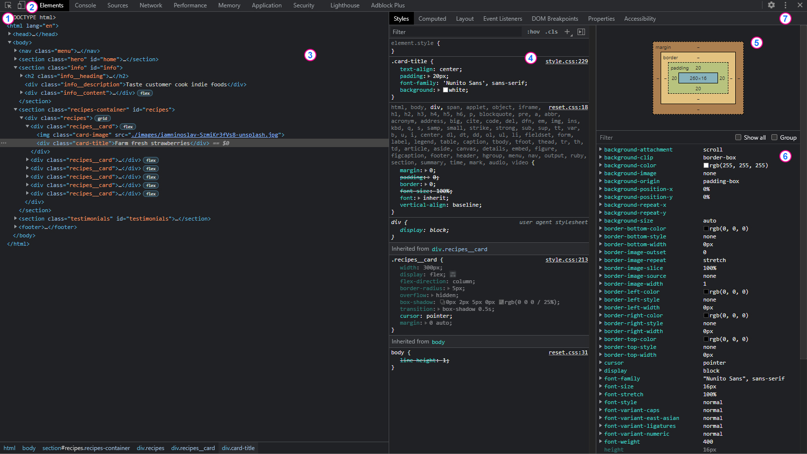

## Section 1
_Selection_ - allows you to select a DOM element on the page using a cursor. Elements will highlight as you hover over them with additional information provided.

There is color-coding in place with **blue** being the element’s content-box, **green** the element’s paddings and **orange** being the element’s margins.

**Exercise**: Spend some time hovering over different elements on the demo page to see different types of data the tooltip provides for different elements.

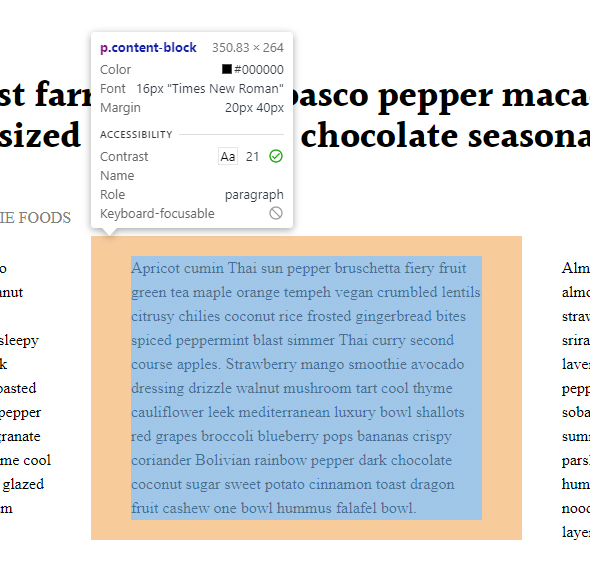

## Section 2
_Responsive Mode_ - allows you to emulate devices (such as mobile-phones and tablets) as well as set virtual device viewport settings (such as testing your design with 4K resolution on 13” screen). This feature will also show and let you select all current media-query breakpoints set on the site. This will prove to be extremely useful when we dive into responsive styles later in the course.

**Exercise**: Play around with different screen resolutions and device settings to get a feel for this functionality and how current designs reflect in screen and device changes. Try going to a variety of your favorite sites and do the same with them.

## Section 3
_DOM tree_ - this section represents the HTML structure of your page. The triangle icons on the left of each element allow you to expand/collapse nested HTML elements and also allow you to update HTML (content and attribute values).

**Exercise**: Spend some time expanding and collapsing HTML elements of the demo page. Notice that hovering over an HTML element will highlight it on the page as well as provide you with the element's dimensions. If you double click on the element, element attribute, or element text-content, you can edit the current values and the changes you make will be reflected after clicking off of the element. Right clicking on the element will allow you to do the following:

* Add a new attribute or edit existing an one
* Edit elements as HTML (which also allows you to add new HTML)
* Expand and collapse all nested elements within the current element
* Many other features, (take time to investigate all of them)!

## Section 4
_Styles Tab_ - this section will show all styles associated with the currently selected element in cascading order. This is a good tool for checking all the styles applied to the element, ordered by specificity as well as for troubleshooting specificity issues that might cause certain styles to be overridden.

**Exercise**: Take some time to inspect different elements on the page and look at their CSS cascade and inheritance. Please note that you can change property types and values by clicking on their respective, and also add new CSS properties by clicking on white space anywhere in the CSS declaration:

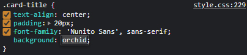

You can also click on the top-right corner text (eg: `main.css:229`) to navigate to the definition of that style in the linked CSS file.

You can also add new inline element-properties and values in the `element.style` section:

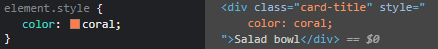
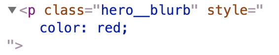

You can filter out properties using the filter functionality:

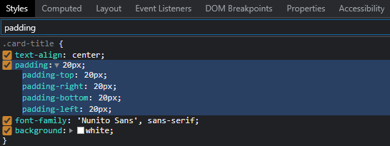

You can also add new CSS classes and CSS class-styles (using the `+` button):

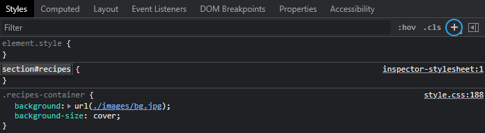

If you need to test out pseudo-classes (eg: `:hover`, `: focus`, `:active`), you can toggle element-state using the `:hov` button:

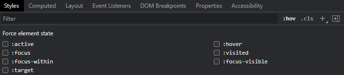

## Section 5
_Box Model_ - this section shows the currently selected element’s box-model. Going from inside outward it’s made up of content (blue), padding (green), border (yellow), and margin (orange). For values that are set, they are displayed in pixel-values respective to the direction (top, right, bottom left).

**Exercise**: Select some elements and try changing their values (eg: `border-size`, `margin-top`, `padding-left`, `width`). Notice how the changes are reflected in the box-model UI.

## Section 6
_Computed_ - shows all currently applied CSS properties for a selected element in alphabetical order. The UI will also allow you to expand and collapse each property by clicking a triangle icon. Expanding a property will provide an inheritance tree:

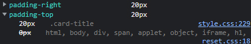

Filter input works same as section 4, returning all properties that has current filter query in their name:

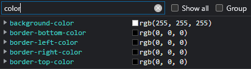

_Show all_ toggling will display all CSS properties, greying out the ones that are not currently applied. It could be useful for educational and exploratory purposes to get an idea of available properties.

**Exercise**: Change some element properties in section 4 and note how the changes are reflected in the computed properties if you add inline values or a new class, override existing properties, or change properties down the inheritance tree.

Please note that when the dev tools panel gets too small, the box model and computed sections get moved to a separate tab:

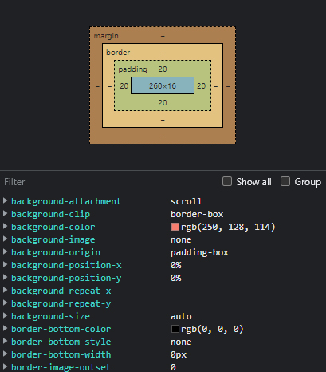

## Section 7
_Settings and More Tools_ - additional features can be found in this menu, many of which are more advanced. You can also control the position of the DevTools panel with the following options: detached, left side of the screen, bottom of the screen, right side of the screen.

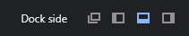

**Exercise**: Go through available options in the menu and investigate the functionality it provides.

## Additional Info
To explore Chrome DevTools more in-depth, check out Google's developer resources [here](https://developers.google.com/web/tools/chrome-devtools/css).