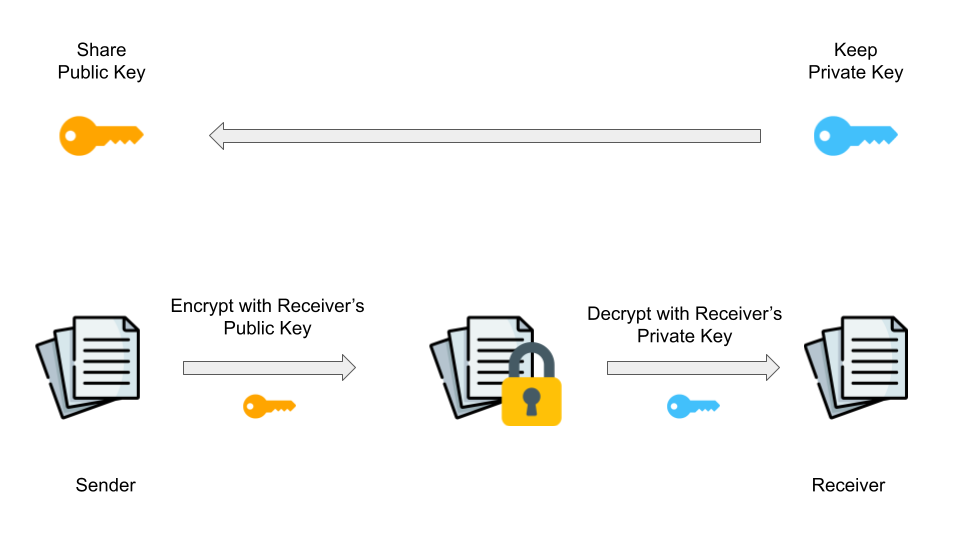

# Lecture: SSH Setup Guide

## What is SSH?

Receiving messages securely using a public-private key-pair.
SSH stands for **S**ecure **SH**ell. It is a cryptographic network protocol which allows users to securely perform several network services (for example, accessing and transferring files) over an unsecured network.

To use SSH protocol, you must create an SSH key and add it to your GitHub account. SSH keys provide a more secure way of logging into a server than using a password alone. While a password can eventually be cracked with a brute force attack, the way that SSH keys are encrypted makes it much more difficult to decipher.

An SSH key comes in the form of a pair of two long strings of characters: a **public key** and a **private key**. A public key can be shared with servers or any party from which the user plans to receive messages (files) safely. Anyone with this public key can encrypt a message that can only be decrypted by the holder of the private key. The private key is stored on the user's computer securely and never shared with anyone. It serves as proof of identity.

Once generated, you can share the public key with the secure server (like GitHub), and then be able to connect to it from the device on which you created the SSH key (your computer). When requests are sent between your computer and the server where your public key is stored, SSH protocol verifies that the public key and private key match. If they do, this will allow the request to be performed without requiring you to enter a password.

You can read more about the SSH public-key authentication [here](https://www.ssh.com/academy/ssh/public-key-authentication). Next, let's set up the SSH key-pair for our machines and share the public key with GitHub.

## Generating and Storing an SSH Key
1. Open your terminal, type the following command, and press enter:
```bash
ssh-keygen -t rsa
```

Hit the return/enter key at each prompt. You can create a passphrase for your SSH key if you wish, or you can leave the passphrase and the other prompts blank.

The output on your terminal should look similar to this:
```bash
Generating public/private rsa key pair.
Enter file in which to save the key (/home/demo/.ssh/id_rsa):
Enter passphrase (empty for no passphrase):
Enter same passphrase again:
Your identification has been saved in /home/demo/.ssh/id_rsa.
Your public key has been saved in /home/demo/.ssh/id_rsa.pub.
The key fingerprint is:
4a:dd:0a:c6:35:4e:3f:ed:27:38:8c:74:44:4d:93:67 demo@a
The key's randomart image is:
+--[ RSA 2048]----+
|          .oo.   |
|         .  o.E  |
|        + .  o   |
|     . = = .     |
|      = S = .    |
|     o + = +     |
|      . o + o .  |
|           . o   |
|                 |
+-----------------+
```

2. Type the following command in your terminal:
```bash
cat ~/.ssh/id_rsa.pub
```
The output in your terminal should look similar to this:
```bash
> ssh-rsa AAAAB3NzaC1yc2EAAAADAQABAAABAQDkAnrxTVIJ2s4sgg3yfiNLb4qfzbntIzM3D1AXNsJp1hbDDr0sDnnOiwRvRRx3aYwPyaiqzZ0wExutkMN3dpmu58gxLKb/L6Trc0dkSTO2TvCPCYLSRaMD3EInChGQukcypCV7FqO/qt/pUGgcODgWX8a6sjdtpGYj0w0hOnvYEmSBJ/w78xPNkY5Cg5uO3ZOUIvz3E1ilHxC3qERpkHLC+OoQoVkpqwpnzZYoJ3eqcMTnW216pytL2/JL4sAxOBPYfr+lIG3vYk3E1kyi7/3vQy/TGp28T+nUCUD55xLuc1OjBSv2HFXXraeW3lu5cVFfW8Su1VdKeu5O5Lf5aBx/ youruser@yourcomputer
```

3. Select the entire output and copy it to your clipboard.

4. Sign in to your GitHub account and click your avatar image towards the top right of the screen.

5. Select the `Settings` button.

6. Click the `SSH and GPG Keys` button on the sidebar on the left side of the screen.

7. Click the green `New SSH Key` button towards the top right of the screen.

8. In the Title bar give your SSH key a name (usually the name of your laptop but you can use any name).

9. In the Key bar paste the entire SSH key that you copied to your clipboard in step 3 and then click the green `Add SSH Key` button.

10. Validate your SSH connection works using the following instructions: [Testing your SSH connection - GitHub Docs](https://docs.github.com/en/authentication/connecting-to-github-with-ssh/testing-your-ssh-connection)

11. You're all set, now you have a secure connection linked between your laptop and your GitHub account.

## Troubleshooting SSH Key Setup
The following resources may be helpful in troubleshooting issues related to generating or configuring your SSH key:

* [Generating a new SSH key](https://docs.github.com/en/github/authenticating-to-github/connecting-to-github-with-ssh/generating-a-new-ssh-key-and-adding-it-to-the-ssh-agent)
* [Adding a new SSH key](https://docs.github.com/en/github/authenticating-to-github/connecting-to-github-with-ssh/adding-a-new-ssh-key-to-your-github-account)