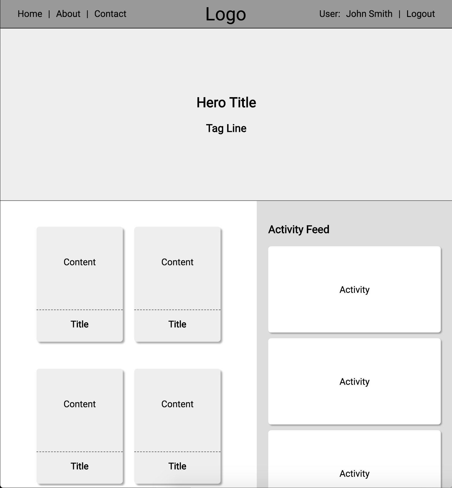

# Exercise: Flexbox

## Scope
The purpose of this exercise is to help you become more comfortable using Flexbox to handle layouts by applying styles on several boxes on a web page.

## Directions
1. Please download the starter code here.

2. Using the provided starter code, apply the appropriate flex rules in the styles.css file to make the page look like the example below.

For more practice with Flexbox, please check out the following online games:

- [Flexbox Froggy](https://flexboxfroggy.com/) - Frogger with a Flexbox twist
- [Flexbox Defense](http://www.flexboxdefense.com/) - A tower defense game using Flexbox to position your towers