# CDA: Debugging JavaScript in the Browser

## Debugging in JavaScript
As a web developer we are bound to make mistakes unknowingly while writing code. Once we start writing thousands of lines of code, we can't keep track of all the changes we made to our code and which piece of code is actually throwing us error or stopping the execution of our code.

> Debugging is a technique used for the step-by-step execution of our code thereby figuring out what mistakes or bugs we have in our code and to fix them. Modern browsers deploy a number of tools to help us debug our code and they are readily available as part of developer tools in any modern browser.

### Setup
- Please download the starter code to be used for this debugging activity.
- Open the starter code in VS Code & run the project using the Live Server extension.

In this particular code along, we are going to look into three important ways, a developer might debug the code:

- using console object (code based approach)
- using Sources Panel available under Developer Tools (UI based approach)
- using debugger; statement (code/UI based approach)

### Using console object (code based approach)
In this approach, we are going to look into different methods available under `console` object and how to use them to output or debug values in our code using browser's console. You might have already seen `console.log()` by now, but let's take a look at how we can get most out of the `console` object for the purpose of debugging.

**Console** is available under browser developer tools which can be opened by:

- right clicking on your page in browser and then clicking on **Inspect**
- by pressing _F12_ key on your keyboard
- or by pressing _Command+Option+I (Mac)_ or __Control+Shift+I (Windows, Linux)_


- Open `scripts/debug-console.js` file & uncomment `<!-- <script src="./scripts/debug-console.js"></script> -->` under `index.html` file. Leave the other `script` tag commented.
    - `console.log`: This method is used to log/output a message to web/browser console. Go and add `console.log("this message is printed in web console using log() method.");` to your script. Open up your console tab in browser and the message should appear.

    - `console.info`: This method is used to log/output informational message to browser console. Add `console.info("user successfully logged in!");` to your script. You might notice it's not much different than `console.log`. But if you were to run this project in Firefox, you would see a blue (i) icon next to your message indicating the message is supposed to provide some information to end user.

    - `console.warn`: This method is used to log/output warning message to browser console. Add `console.warn("Warning! username is not of type string");` to your script. In this case, you will find the message has some yellow-orangy color added to it to make it more prominent as a warning message.

    - `console.error`: This method is used to log/output error message to browser console. Add `console.error("Error! Something went wrong! Please try again");` to your script. In this case, you will find the message has red color added to it to make it more prominent as an error message.

    - `console.table`: Sometimes it is easier to see JavaScript Objects & Arrays in a user-friendly tabular format. This method is used to log/output arrays & objects to browser console in tabular format so one can easily navigate & spot data points of interest during debugging. You should already have a `locations` array & a `student` object provided in script. Let's add following piece of code to our script so we can visualize our array and object in tabular format.

    ```javascript
    console.log("Locations data (array) in tabular format: ");
    console.table(locations);
    console.log("Student information (object) in tabular format: ");
    console.table(student);
    ```

    - `console.time` & `console.timeEnd`: Often times we would like to enhance the performance of our web application. In that case, it is very useful to check how long a piece of code might take to execute. These methods are designed exactly for that. Any code between `console.time('total_execution_time')` and `console.timeEnd('total_execution_time')` will be timed and we should see a timestamp in milliseconds printed after successful execution of code. _The strings inside of this method can be anything you want._ Mostly it refers to the amount of time our code took to execute. Let's add following piece of code to our script:

    ```javascript
    console.time('total_execution_time');

    function add(num1, num2){
        console.log('Addition is: ', num1 + num2);
    }
    function multiply(num1, num2){
        console.log('Multiplication is: ', num1 * num2);
    }
    
    add(20, 40); // call the addition function
    multiply(3, 4); // call the multiplication function
    console.timeEnd('total_execution_time');
    ```

    

### Using Sources Panel available under Developer Tools (UI based approach)

In this approach, we will take a look at debugging tools provided by all modern browsers. Use this approach when you are trying to resolve a bug or an error that is much more complicated and requires investigating the code line by line.

We will switch to another part of Developer Tools in this method called _Sources Panel_. You can open it in similar way by first opening your developer tools in browser and then navigating to _Sources_.


As you can see there are 3 main parts or views under Sources Panel:

- File Navigator or Page Pane
- Code Editor or Editor Pane
- Debug Pane

If you don't see File Navigator Pane, you can click _Show Navigator_ button in top-left corner as shown below.


Let's start debugging now:

- For this approach, we have purposely introduced errors in all the function calls. Our job is to use debugging using Sources Panel to deep dive into the calculator function and learn how to fix our function calls so that they return the right value.

- First let's switch our script files in `index.html`. Comment `<script src="./scripts/debug-console.js"></script>` & uncomment `<script src="./scripts/debug-source.js"></script>`.

- As soon as you add the script file, you will see a console error displayed in browser. We have purposely made some mistakes in our code & your job is to fix these errors by using debugging tools under Sources Panel.


- Under _Sources_ Panel, click on your `debug-source.js` file under File Navigator Panel. You should see the code written in this script file being displayed under Code Editor.

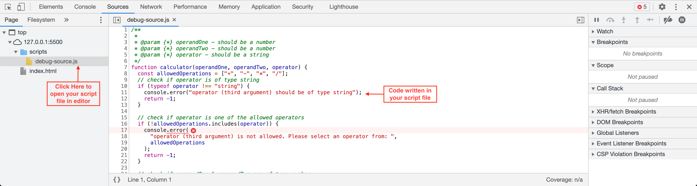

- Let's add a _breakpoint_ in our code Editor. As you can see we have added a breakpoint on line #8 and line #56 by clicking on respective line number we see under Code Editor Pane.

- A breakpoint is essentially the line in your code where the execution will stop so you can start debugging the values up until that point in your code and see why they may be different or incorrect.

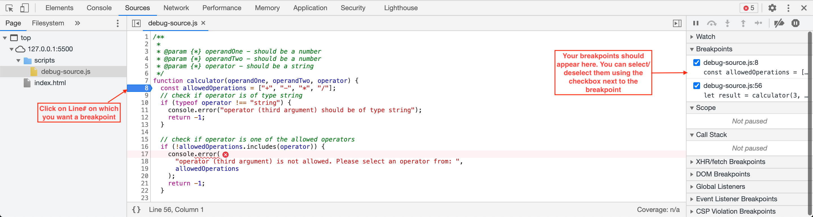
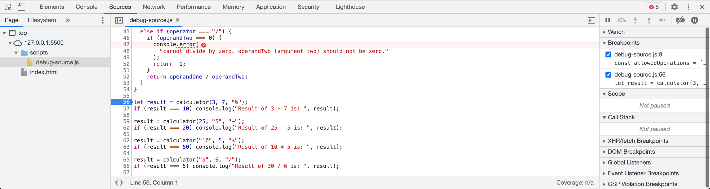

- Refresh your page in browser. You will find that your code execution has paused.
- You should see a small tool appear on the top that will allow you to pause/resume your script execution.
- In your Debugger Pane, you can see the _stepping buttons_ will be activated. You can:
    - _resume execution_: go to next breakpoint or resume execution of script if no breakpoints left.
    - _step_: run the next command or line of code. When you click step again and again, you basically go through your code line by line, inspect different values & try to debug what is wrong in your code.
    - _step over_: similar to step but if your next line of code is a function call to a function that you wrote, it will invisibly execute the function without going into the function definition and code written in that function. Quite useful when we are not interested in debugging every function call and see how it is working internally.
    - _step into_: similar to _step_ but it also steps into _asynchronous_ function calls like `setTimeout` and waits until is it successfully executed. Not much useful as compared to step.
    - _step out_: steps out of current function call so we can skip through entire function if we accidentally entered it by using _step into_.
    - alternatively, you can also _enable/disable breakpoints_ as shown below.
- For this exercise, we will just use _step _over or _resume execution_ functionality.

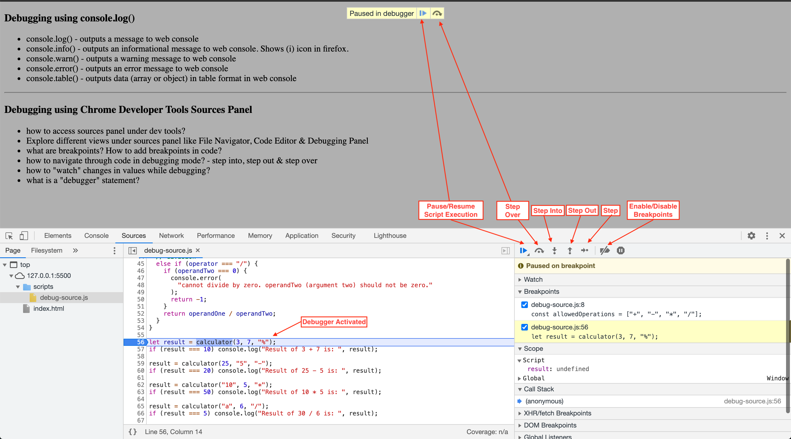

- Now, lets watch some variables to see how their value changes over time during execution. Add `result` variable to watch as shown below. And then step over to next breakpoint.

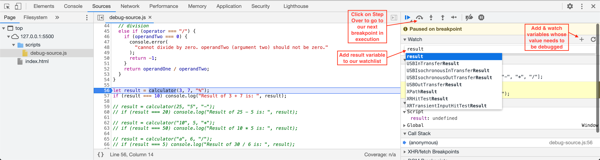

- On your next breakpoint, check all the values populated so far as shown.
- Add more breakpoints in your function & use _resume execution_ or _step over_ buttons to go to next breakpoint.

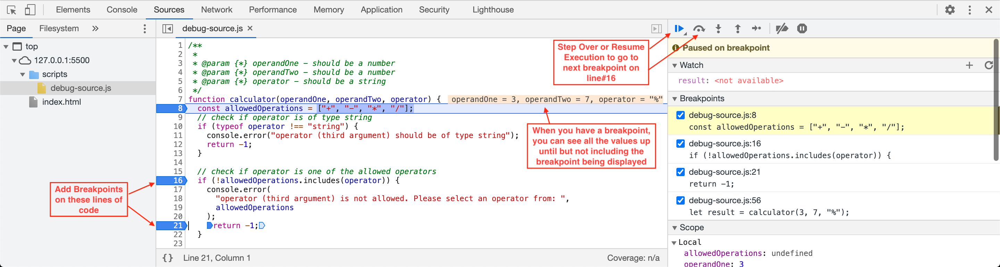

- On your next debug point, hover over `allowedOperations` and `operator` values to see if operator is included in `allowedOperations` array. If not, we will return -1 and not perform any calculations.

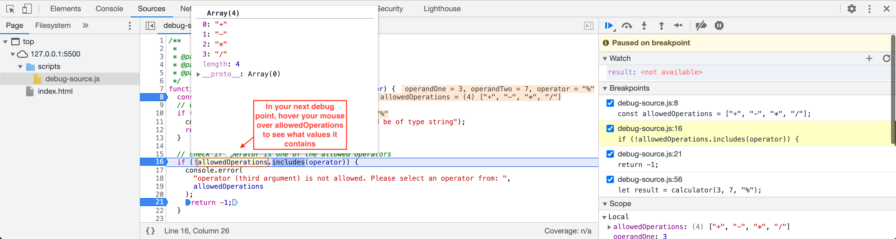
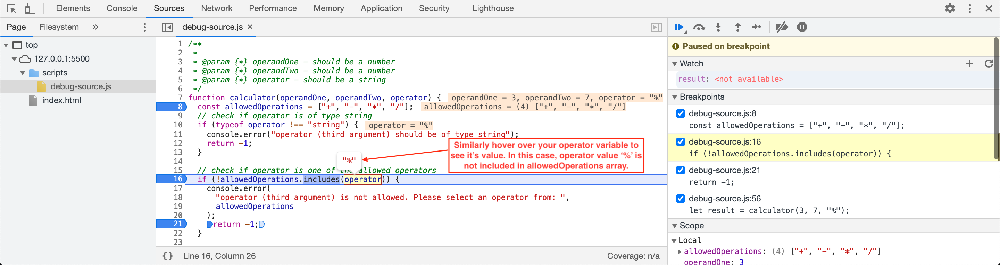
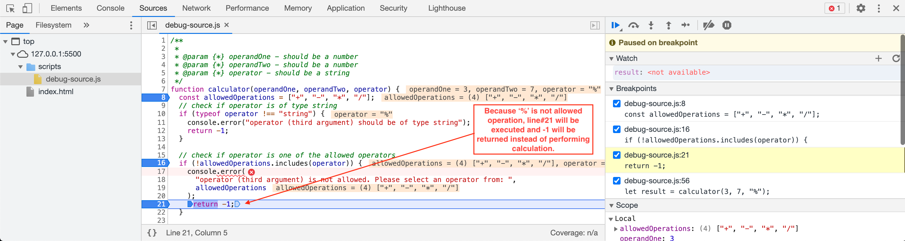

- `-1` is returned from the function as `operator` value of `%` is not one of the allowed operations listed in `allowedOperations` array.
- `-1` will be stored in `result` variable which we added to our watch list.
- Because `-1` is not equal to expected value of `10`, we won't see the result printed using the console.log statement.

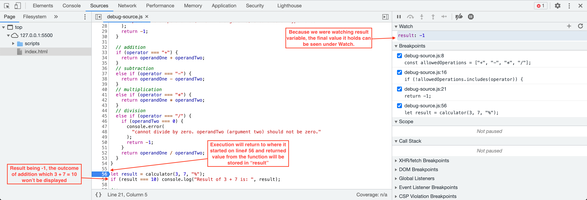

- Now, lets go and fix our code. Open `debug-source.js` script in VS Code and change our function call from `let result = calculator(3, 7, "%");` to be `let result = calculator(3, 7, "+");`;
- Also add another breakpoint as shown below.

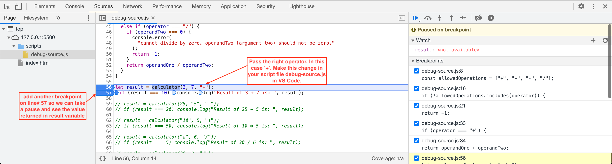

- Let's repeat the same process now by debugging step by step.
- As you step into the function, add more breakpoints around logic where we check `operator` to be `+` as shown.

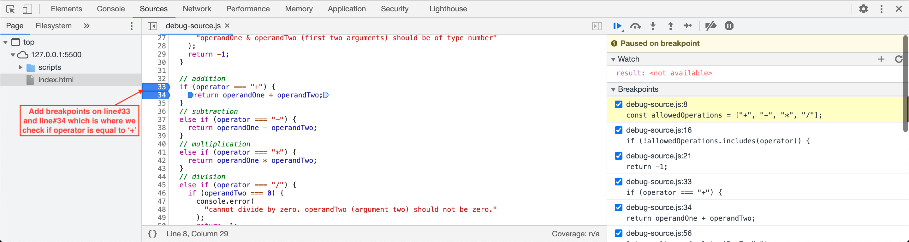

- Hover on `operator` variable to see it's value. Now that our `operator` value matches to '+', we will return the sum of `operandOne` and `operandTwo` instead of -1.

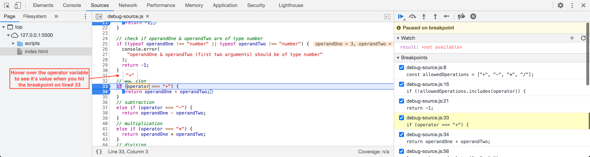

- Our function execution will now return to where it started. Value of `10` will be stored in result. Because `result` value will match to `10`, we will see the output being displayed under console and we won't see any errors now.

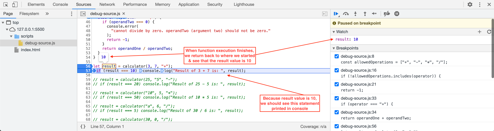
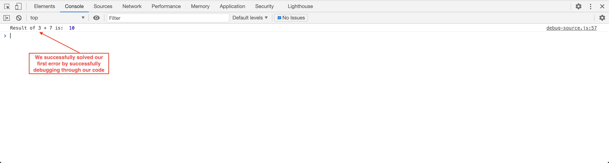

- Now that we know how to debug & solve issues, let's uncomment the next function calls one by one and solve the issue using debugging techniques before moving onto the next function call.

### Using `debugger;` statement (code/UI based approach)
In this approach, we are going to take a look into another way to debug your code.
- This approach is quite similar to previous approach of using _Sources_ Panel.
- The only difference is in _how we add a breakpoint_?
- In previous approach, we added breakpoints by clicking on different lines of code under _Sources_ Panel.
- In this approach, we will add `debugger;` statement to our code wherever we want our breakpoint to be.
- This approach is quite verbose and you end up adding `debugger;` statements directly to your code which makes it less useful and prone to forgetting to remove these debugging statements later on.
- Hence, use this approach to activate a breakpoint in your code & then using _Sources Panel_ to debug the code.
- Here is quick demo on how to use this approach:
- First make sure, you remove all the breakpoints you added in previous approach by navigating to your _Sources_ Panel and right clicking under _Breakpoints_ section. After that, click on _Remove all breakpoints_.

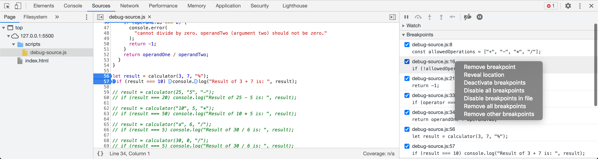

- Now in VS Code, open your `debug-source.js` script and add a `debugger;` statement as first line of code in your function.

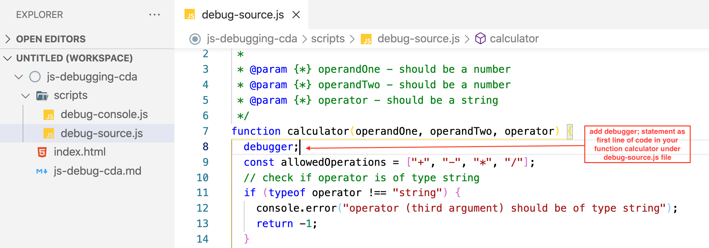

- As soon as you add `debugger;` statement & run your project, you will see debugger activated on your page in browser in the similar way we saw in previous approach.
- From here onwards, the debugging process will remain the same - where you will step over or into different breakpoints, watch different values and figure out why certain pieces of code might not work.
- In this case, because you didn't add any breakpoints through UI in _Sources_ Panel, you will use step functionality to go line by line and debug your code for potential issues or bugs.
- Alternatively, you can now manually add breakpoints in _Sources_ Panel just like we did in previous approach after debugger has been activated in browser.

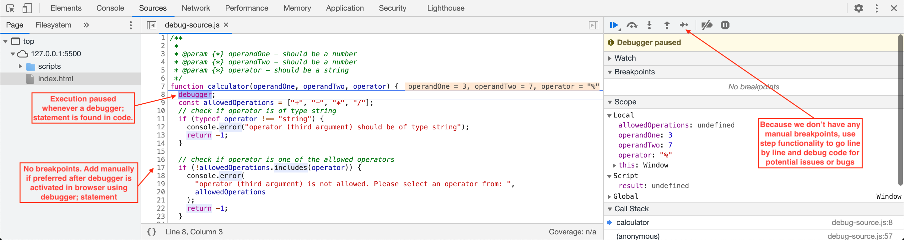

## Final Points
- Use `console` object and its methods to quickly debug or print values in browser's console.
- For more in-depth debugging, use _Sources Panel_
- Watch for key variables and how their values change over time
- Add multiple breakpoints but don't clutter the debugger by adding one breakpoint on each line of code
- Check for data type when not sure.
- Handle `null` & `undefined` values properly in your code

## Resources
- [Debugging in JavaScript](https://developer.chrome.com/docs/devtools/javascript/)
- [Debugging in Chrome](https://javascript.info/debugging-chrome)
- [Debugging Tips](https://raygun.com/learn/javascript-debugging-tips)