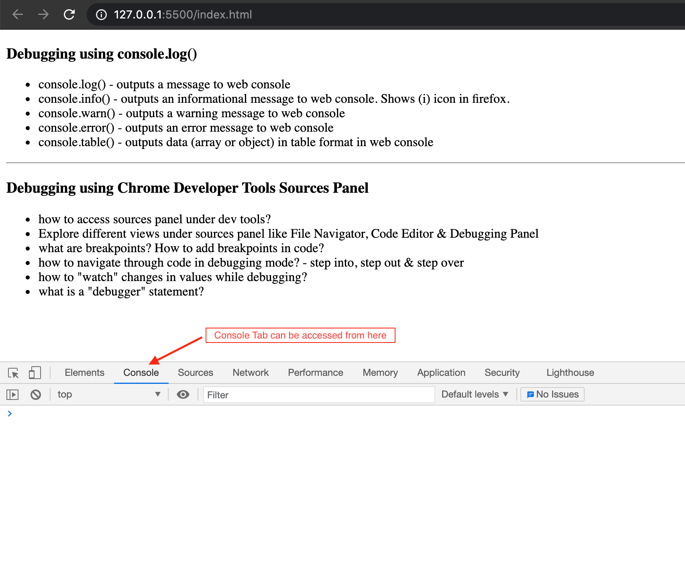
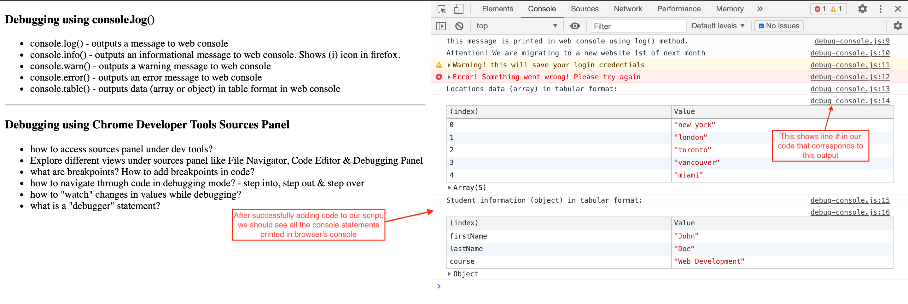
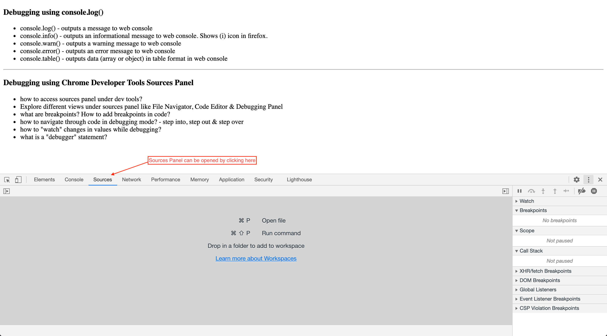
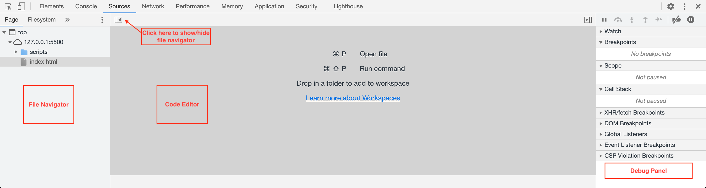
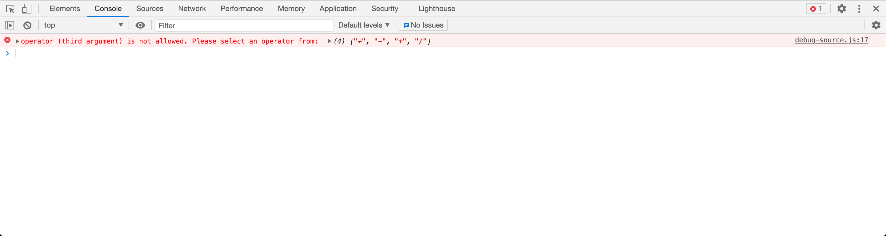

# CDA: Debugging JavaScript in the Browser

## Debugging in JavaScript
As a web developer we are bound to make mistakes unknowingly while writing code. Once we start writing thousands of lines of code, we can't keep track of all the changes we made to our code and which piece of code is actually throwing us error or stopping the execution of our code.

> Debugging is a technique used for the step-by-step execution of our code thereby figuring out what mistakes or bugs we have in our code and to fix them. Modern browsers deploy a number of tools to help us debug our code and they are readily available as part of developer tools in any modern browser.

### Setup
- Please download the starter code to be used for this debugging activity.
- Open the starter code in VS Code & run the project using the Live Server extension.

In this particular code along, we are going to look into three important ways, a developer might debug the code:

- using console object (code based approach)
- using Sources Panel available under Developer Tools (UI based approach)
- using debugger; statement (code/UI based approach)

### Using console object (code based approach)
In this approach, we are going to look into different methods available under `console` object and how to use them to output or debug values in our code using browser's console. You might have already seen `console.log()` by now, but let's take a look at how we can get most out of the `console` object for the purpose of debugging.

**Console** is available under browser developer tools which can be opened by:

- right clicking on your page in browser and then clicking on **Inspect**
- by pressing _F12_ key on your keyboard
- or by pressing _Command+Option+I (Mac)_ or __Control+Shift+I (Windows, Linux)_



- Open `scripts/debug-console.js` file & uncomment `<!-- <script src="./scripts/debug-console.js"></script> -->` under `index.html` file. Leave the other `script` tag commented.
    - `console.log`: This method is used to log/output a message to web/browser console. Go and add `console.log("this message is printed in web console using log() method.");` to your script. Open up your console tab in browser and the message should appear.

    - `console.info`: This method is used to log/output informational message to browser console. Add `console.info("user successfully logged in!");` to your script. You might notice it's not much different than `console.log`. But if you were to run this project in Firefox, you would see a blue (i) icon next to your message indicating the message is supposed to provide some information to end user.

    - `console.warn`: This method is used to log/output warning message to browser console. Add `console.warn("Warning! username is not of type string");` to your script. In this case, you will find the message has some yellow-orangy color added to it to make it more prominent as a warning message.

    - `console.error`: This method is used to log/output error message to browser console. Add `console.error("Error! Something went wrong! Please try again");` to your script. In this case, you will find the message has red color added to it to make it more prominent as an error message.

    - `console.table`: Sometimes it is easier to see JavaScript Objects & Arrays in a user-friendly tabular format. This method is used to log/output arrays & objects to browser console in tabular format so one can easily navigate & spot data points of interest during debugging. You should already have a `locations` array & a `student` object provided in script. Let's add following piece of code to our script so we can visualize our array and object in tabular format.

    ```javascript
    console.log("Locations data (array) in tabular format: ");
    console.table(locations);
    console.log("Student information (object) in tabular format: ");
    console.table(student);
    ```

    - `console.time` & `console.timeEnd`: Often times we would like to enhance the performance of our web application. In that case, it is very useful to check how long a piece of code might take to execute. These methods are designed exactly for that. Any code between `console.time('total_execution_time')` and `console.timeEnd('total_execution_time')` will be timed and we should see a timestamp in milliseconds printed after successful execution of code. _The strings inside of this method can be anything you want._ Mostly it refers to the amount of time our code took to execute. Let's add following piece of code to our script:

    ```javascript
    console.time('total_execution_time');

    function add(num1, num2){
        console.log('Addition is: ', num1 + num2);
    }
    function multiply(num1, num2){
        console.log('Multiplication is: ', num1 * num2);
    }
    
    add(20, 40); // call the addition function
    multiply(3, 4); // call the multiplication function
    console.timeEnd('total_execution_time');
    ```

    

### Using Sources Panel available under Developer Tools (UI based approach)

In this approach, we will take a look at debugging tools provided by all modern browsers. Use this approach when you are trying to resolve a bug or an error that is much more complicated and requires investigating the code line by line.

We will switch to another part of Developer Tools in this method called _Sources Panel_. You can open it in similar way by first opening your developer tools in browser and then navigating to _Sources_.



As you can see there are 3 main parts or views under Sources Panel:

- File Navigator or Page Pane
- Code Editor or Editor Pane
- Debug Pane

If you don't see File Navigator Pane, you can click _Show Navigator_ button in top-left corner as shown below.



Let's start debugging now:

- For this approach, we have purposely introduced errors in all the function calls. Our job is to use debugging using Sources Panel to deep dive into the calculator function and learn how to fix our function calls so that they return the right value.

- First let's switch our script files in `index.html`. Comment `<script src="./scripts/debug-console.js"></script>` & uncomment `<script src="./scripts/debug-source.js"></script>`.

- As soon as you add the script file, you will see a console error displayed in browser. We have purposely made some mistakes in our code & your job is to fix these errors by using debugging tools under Sources Panel.

