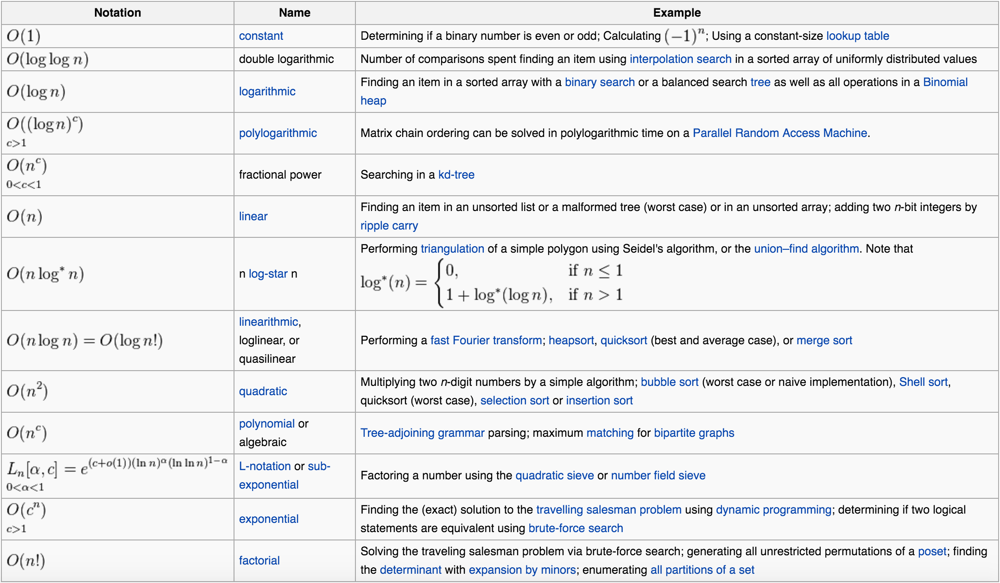

# Algorithms and Optimization: Complexity
Writing algorithms is only one part of solving problems with code. Computer scientists often have to think - in a very abstract manor - how long does an algorithm take to run for the extreme case? This is a very difficult way to think and requires that a person be comfortable with answering questions conceptually and not absolutely.

The video below is an introduction to this way of thinking.

## Big-O Notation
Computer Scientists came up with a way to classify the complexity of an algorithm according to the size of the dataset being solved, and the number of times an algorithm must repeat to find the solution. This is called the algorithm's "Order of Complexity" and is categorized by "Big-O Notation", as shown below:

The chart above is a mathematical way to express time complexity based on an algorithms structure. For example, a for loop can run `n times` where n is usually the number of elements in an array. For this reason a for loop has O(n) complexity which is the fourth fastest run time in the chart above. An algorithm that has a for loop in it has a minimum run time of O(n).

If you have an algorithm that has a for loop inside of a for loop (so traversing a two dimensional array) then its complexity would be n x n, which evaluates to n2.

The study of complexity is a very difficult science but thinking this way can help you write more optimal code. Be aware however though, sometimes as much as you want reduce your complexity, sometimes you can only do so well.