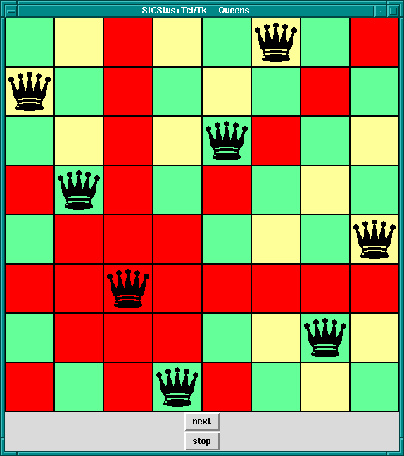

# Algorithms and Optimization: Optimization

When it comes to solving problems with computers, programmers ask themselves several questions before starting out. The two at the for front of their mings will always be:

1. Is there a solution to the problem?
2. What is the fastest way to solve it?

These questions don't always have an answer and for many that can be a hard concept to accept. For computer scientist the answers become more of a question of optimization. If we can't answer these questions in the absolute, what can we do to ensure that however we answer these questions, it's the absolute best we can do right now.

## Study: N-Queens Problem
One classic problem studied by computing students is the N-Queens problem. The N-queens problem involves placing N queens on an NxN chess board so that no Queens are attacking any other Queens. A standard starting point is with 8 queens on a typical 8x8 chess board. Algorithms that solve this type of problem have useful applications in memory storage schemes, traffic control, and even parts of the traveling salesmen problem used to solve routing.

For an 8x8 board there are `16777216` possible solutions, and for 16x16 board there are `18446744073709551616`. Optimization is all about finding a solution in the shortest amount of time. That is why there are several ways to solve the problem.

### Brute Force
Brute force involves randomly placing Queens on the board until you reach a solution. This can be easy for small sets like a 4x4 board, but as you get to larger and larger boards this approach becomes extremely slow.

### Recursive Back Tracking

This solution uses recursion to place queens in each row one at a time and back propogate when there are conflicts. This algorithm provides an incredible time increase over brute force.

### Hill-Climbing

Hill Climbing is a sub set of the [gradient descent](https://en.wikipedia.org/wiki/Gradient_descent) used in calculus and requires calculating state transitions. The algorithm is very complex but is a further improvement on the recursive solution.

What it's important to think about at this point is how do we know definitively that each algorithm is indeed an improvement? How can we prove that assumption?