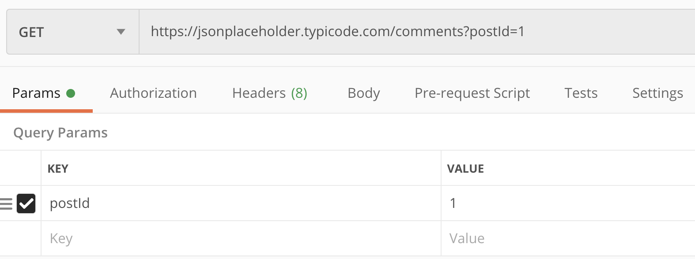
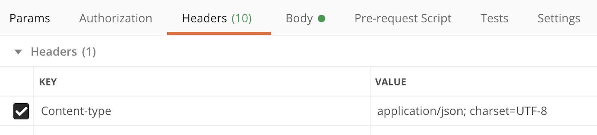
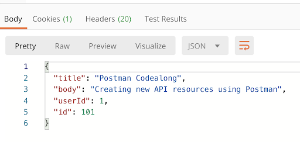

# Challenge: Codealong: APIs & Postman

## Introduction
The purpose of this codealong is to use JSONPlaceholder at [https://jsonplaceholder.typicode.com](https://jsonplaceholder.typicode.com/), to consume APIs by using Postman.

Make sure you download the Postman app before getting started - [https://www.postman.com/](https://www.postman.com/)

Postman allows us to make test calls to APIs using common HTTP verbs. It is similar to Chrome Dev Tools, as it is often used to “debug” your APIs or simply make test calls so that you can concentrate on the data, not the implementation.

## Making GET Requests
Let’s start with making a `GET` request to our API:

After clicking **Send** button (or pressing **Enter**), you will see the interface of the app make a request and after some time you should get a response at the bottom of the screen under the _Body_ tab (other tabs allow you to inspect _Cookies and Headers_ associated with the request).

You can also change the way the data gets displayed:

**Pretty** will give you an expandable/collapsible syntax highlighted JSON representation. On the other hand, **Raw** is a plain text indented representation, and **Preview** is a text only representation of the response.

Try out other `GET` endpoints for the API and inspect their responses:

- `/posts/1`
- `/posts/1/comments`
- `/comments?postId=1`
- `/posts?userId=1`

Please note that for the last two requests which have query params in the URLs, Postman automatically puts the query param key and value in the interface:

You can always add query params in the URL or UI of Postman, depending on your preference, the functionality would be identical.

## Making POST requests
Now let’s try to make a `POST` request to our API which is used to create a new resource. Because we are creating new resource, we will need to provide some additional information alongside our request.

First, we need to change our HTTP verb to `POST` in the UI and the API endpoint for creating new resource:

Next, in **Headers** tab, we need to add a content header that will specify the format and encoding of the data we will be sending to the server:

Finally, we need to provide the actual data to send to the server:

In the **Body** tab, change the data type to **raw** and **JSON**. In the body section of the UI, insert the data in JSON (make sure you enter valid JSON, so don’t forget the quotes around keys and values).

Now we are ready to send our request! A successful response will appear as the following (your generated `id` might be different):

## Diving Deeper
With your new gained knowledge follow the JSONPlaceholder Guide examples and use Postman to complete them. Use the provided `fetch` examples as a reference for any information you might require to successfully fulfill these requests with Postman. Complete following sections:

- Update a resource (PUT and PATCH)
- Delete a resource
- Filtering resources (using query params)
- Nested resources